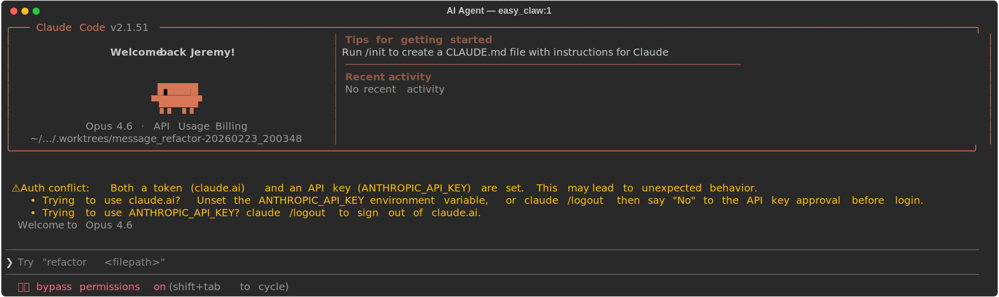
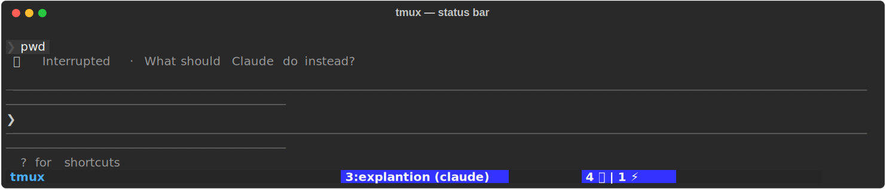
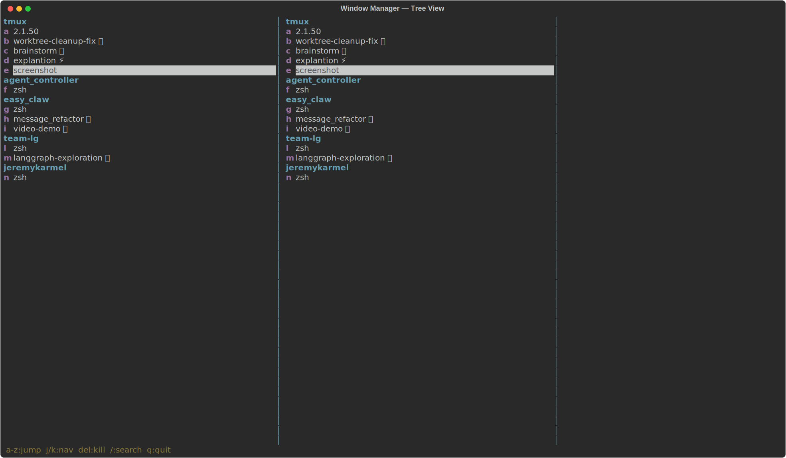
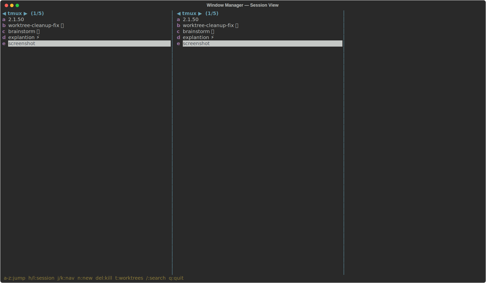
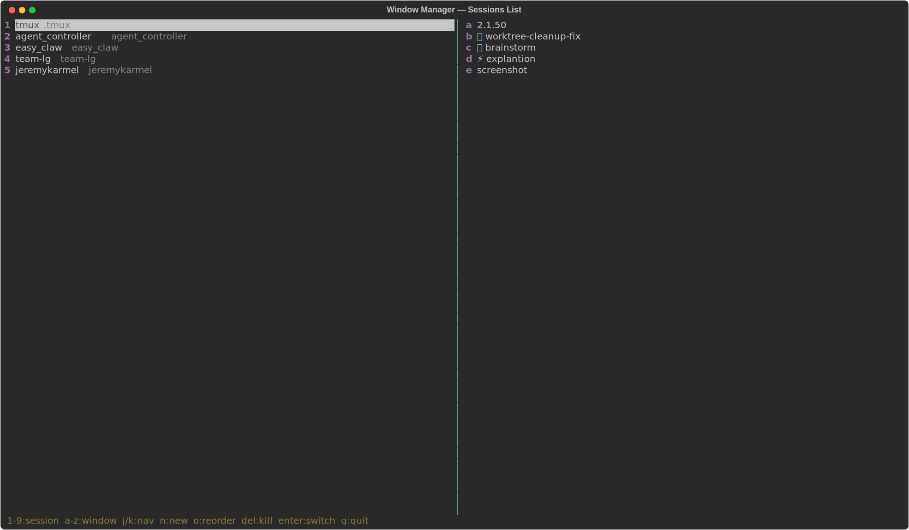
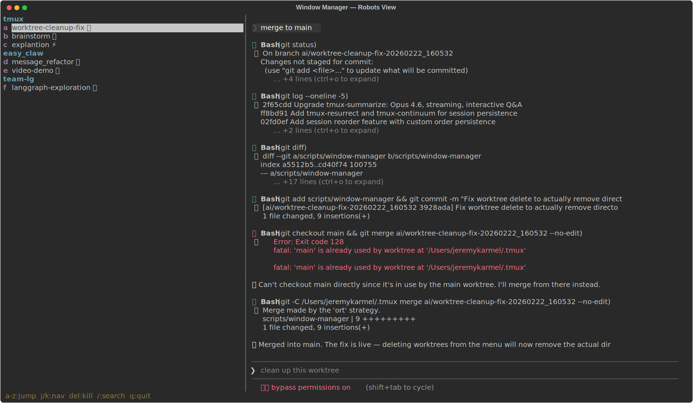

# tmux AI Command Center

A batteries-included tmux configuration purpose-built for managing AI coding agents. Launch Claude or Codex into isolated git worktrees, monitor their progress from a live status bar, browse and merge their work when they're done — all without leaving the terminal.

---

## Table of Contents

- [Quick Start](#quick-start)
- [Keybinding Reference](#keybinding-reference)
- [AI Agent Launcher](#ai-agent-launcher)
- [AI Status Bar](#ai-status-bar)
- [Window Manager](#window-manager)
- [Robots View (Worktree Browser)](#robots-view-worktree-browser)
- [Pane Summarizer](#pane-summarizer)
- [Session & Window Management](#session--window-management)
- [Session Persistence](#session-persistence)
- [File Explorer](#file-explorer)
- [Plugins](#plugins)

---

## Quick Start

The prefix key is **`Option+B`** (`M-b`). Most day-to-day shortcuts work without a prefix — just hold Option.

| Shortcut | What it does |
|----------|-------------|
| `Option+A` | Launch an AI agent (the main entry point) |
| `Option+E` | Open the window manager |
| `Option+R` | Browse AI worktrees (robots view) |
| `Option+Q` | Summarize the current pane with Claude |
| `Option+S` | Browse and reorder sessions |
| `Option+J` / `Option+K` | Next / previous window |

---

## Keybinding Reference

### No-prefix shortcuts (hold Option)

| Key | Action |
|-----|--------|
| `Option+A` | AI session launcher (pick session, then pick agent + task) |
| `Option+E` | Window manager — tree view |
| `Option+W` | Window manager — session-focused view |
| `Option+S` | Window manager — sessions list |
| `Option+R` | Window manager — robots / worktrees view |
| `Option+Q` | Pane summarizer (Opus 4.6 + interactive Q&A) |
| `Option+J` | Next window |
| `Option+K` | Previous window |
| `Option+]` | Next session |
| `Option+[` | Previous session |
| `Option+U` | Enter scroll / copy mode |
| `Option+7` | Kill current window (with confirmation) |

### Prefix shortcuts (`Option+B`, then...)

| Key | Action |
|-----|--------|
| `A` | AI agent popup (quick launch in current session) |
| `w` | Choose-tree with AI status icons |
| `f` | Fuzzy-find and switch to any window |
| `t` | Open nvim-tree file explorer |
| `O` | Reorder windows via vim |
| `S` | Reorder sessions via vim |

### Inside copy mode

| Key | Action |
|-----|--------|
| `Option+U` | Half-page up |
| `Option+D` | Half-page down |

---

## AI Agent Launcher

**Shortcut:** `Option+A`

The agent launcher is a multi-step popup that walks you through launching an AI coding agent in a fully isolated git worktree.

### Workflow

**1. Pick a session** — Choose which tmux session to work in, or create a new one from a folder picker.

**2. Pick an agent** — Select `claude` or `codex`.

**3. Pick a task** — Start an interactive session, or select a todo file from your `todos/` directory for autonomous execution.

**4. Agent launches in a worktree** — A fresh git worktree is created under `.worktrees/` with an `ai/`-prefixed branch. The agent runs in complete isolation from your working copy.



**5. Merge when done** — When the agent finishes, you're prompted to merge, keep, or discard the changes. Safety gates check that your main branch hasn't moved and your working tree is clean.

### Quick launch (Prefix + A)

For a faster path when you're already in the right session, `Prefix + A` opens the agent picker directly — skipping session selection.

---

## AI Status Bar

The status bar gives you a live overview of all AI agents running across your tmux server.



### Layout

```
 ┌──────────────────────────────────────────────────────────┐
 │ session-name  ^ │           2:main │ 1 ⚡ | 2 🤖 | 1 ✅ │
 └──────────────────────────────────────────────────────────┘
   session name  prefix     current     AI agent counts
                 flash      window
```

### Agent states

| Icon | State | Meaning |
|------|-------|---------|
| ⚡ | Active | Pane content is changing — agent is working |
| 🤖 | Idle | Content hasn't changed recently — agent is waiting for input |
| ✅ | Done | Agent process has exited |

The background monitor (`ai-monitor.sh`) polls every 3 seconds, compares pane content hashes, and updates the status bar automatically. The counts only appear when AI agents are running.

### Choose-tree integration

`Prefix + w` opens the built-in choose-tree with AI status icons inline — so you can see at a glance which agents need attention.



---

## Window Manager

**Shortcut:** `Option+E`

A custom curses-based window manager that replaces tmux's built-in choose-tree with a richer UI featuring live pane previews, hotkeys, and fuzzy search.


### Tree view (`Option+E`)

Sessions appear as headers with their windows nested underneath. The right panel shows a live preview of the selected window's terminal content — with full ANSI color preservation.

| Key | Action |
|-----|--------|
| `j` / `k` | Navigate windows |
| `1-9` | Jump to numbered window |
| `a-z` | Jump to lettered window |
| `/` | Fuzzy search across all windows |
| `Enter` | Switch to selected window |
| `n` | Create new window (prompts for name) |
| `Del` | Delete window (with confirmation) |

AI windows show their status emoji (⚡ 🤖 ✅) inline.

### Session-focused view (`Option+W`)

Shows one session at a time. Use `h` / `l` to cycle through sessions while `j` / `k` navigates windows within the current session.



### Sessions list (`Option+S`)

Browse all sessions with their working directories. The right panel previews the windows in each session.



| Key | Action |
|-----|--------|
| `j` / `k` | Navigate sessions |
| `1-9` | Jump to numbered session |
| `Enter` | Switch to session |
| `n` | Create new session (folder picker) |
| `o` | Reorder sessions via vim |
| `Del` | Kill session |

Session order is persisted in `~/.tmux/session-order` and respected everywhere sessions are listed.

---

## Robots View (Worktree Browser)

**Shortcut:** `Option+R`

A dedicated view for managing AI agent worktrees. Shows only AI-related windows with their worktree metadata.



### Columns

| Column | Description |
|--------|-------------|
| Window | Agent window name with status emoji |
| Worktree | Path to the `.worktrees/` directory |
| Branch | The `ai/` branch name |
| Commit | Short hash of last commit |
| Age | Time since last commit |
| Status | Clean / dirty / prunable |
| Merged | Whether all commits are reachable from main |
| Diffs | Whether there are uncommitted changes |

### Commands

| Key | Action |
|-----|--------|
| `c` | Launch Claude in the selected worktree |
| `x` | Launch Codex in the selected worktree |
| `z` | Open a shell in the selected worktree |
| `Del` | Delete worktree (removes directory + branch) |
| `d` | Show worktree details |

This view scopes worktrees to the current session's git repo and sorts oldest-first so you can triage stale work.

---

## Pane Summarizer

**Shortcut:** `Option+Q`

Captures the current pane's terminal output and sends it to Claude Opus 4.6 for analysis — with streaming output and interactive follow-up questions.

### What it shows

The summary is organized into three sections:

- **In Progress** — Currently running processes, pending prompts, incomplete work
- **Previously Completed** — Commands that have finished and their outcomes
- **Notes** — Errors, warnings, environment details, notable paths

### Interactive Q&A

After the initial summary, you can ask follow-up questions about the pane content. The conversation maintains full context so you can dig deeper.

Press `Ctrl+C` to exit.

### Configuration

| Variable | Default | Description |
|----------|---------|-------------|
| `TMUX_SUMMARIZE_SCROLLBACK` | `500` | Lines of scrollback to capture |
| `TMUX_SUMMARIZE_ENV_FILE` | auto-detect | Path to `.env` file with `ANTHROPIC_API_KEY` |

---

## Session & Window Management

### Window navigation

| Shortcut | Action |
|----------|--------|
| `Option+J` | Next window |
| `Option+K` | Previous window |
| `Option+7` | Kill current window (confirms first) |

### Session navigation

| Shortcut | Action |
|----------|--------|
| `Option+]` | Next session |
| `Option+[` | Previous session |

### Reorder windows (`Prefix + O`)

Opens your windows in vim. Move lines to reorder, delete lines to close windows. `:wq` to apply.

### Reorder sessions (`Prefix + S`)

Opens your sessions in vim. Move lines to reorder, delete lines to close sessions. Custom order persists to `~/.tmux/session-order`.

### Fuzzy window switcher (`Prefix + f`)

A lightweight fzf-based window switcher that lists all windows across all sessions.

---

## Session Persistence

Sessions are automatically saved and restored using tmux-resurrect and tmux-continuum.

- **Auto-save** every 15 minutes
- **Auto-restore** when tmux server starts
- **Pane contents** are preserved (not just layout)
- Manual save: `Prefix + Ctrl+S`
- Manual restore: `Prefix + Ctrl+R`

Survives crashes, reboots, and terminal restarts.

---

## File Explorer

**Shortcut:** `Prefix + t`

Opens nvim-tree in a new window rooted at the current pane's directory. Full file browsing, creation, deletion, and renaming — without leaving tmux.

---

## Plugins

| Plugin | Purpose |
|--------|---------|
| [tpm](https://github.com/tmux-plugins/tpm) | Plugin manager |
| [tmux-sensible](https://github.com/tmux-plugins/tmux-sensible) | Sensible defaults |
| [tmux-autoreload](https://github.com/b0o/tmux-autoreload) | Auto-reload config on save |
| [tmux-menus](https://github.com/jaclu/tmux-menus) | Context menus |
| [tmux-fzf](https://github.com/sainnhe/tmux-fzf) | Fuzzy finder integration |
| [tmux-fzf-url](https://github.com/wfxr/tmux-fzf-url) | Click URLs from pane output |
| [tmux-open](https://github.com/tmux-plugins/tmux-open) | Open files and URLs |
| [tmux-fuzzback](https://github.com/roosta/tmux-fuzzback) | Search pane scrollback |
| [port](https://github.com/fiqryq/port) | Port management |
| [treemux](https://github.com/kiyoon/treemux) | nvim-tree file explorer |
| [tmux-resurrect](https://github.com/tmux-plugins/tmux-resurrect) | Save/restore sessions |
| [tmux-continuum](https://github.com/tmux-plugins/tmux-continuum) | Auto-save/restore sessions |
| tmux-summarize | LLM pane summarization (custom) |
| tmux-reorder | Window/session reordering (custom) |
